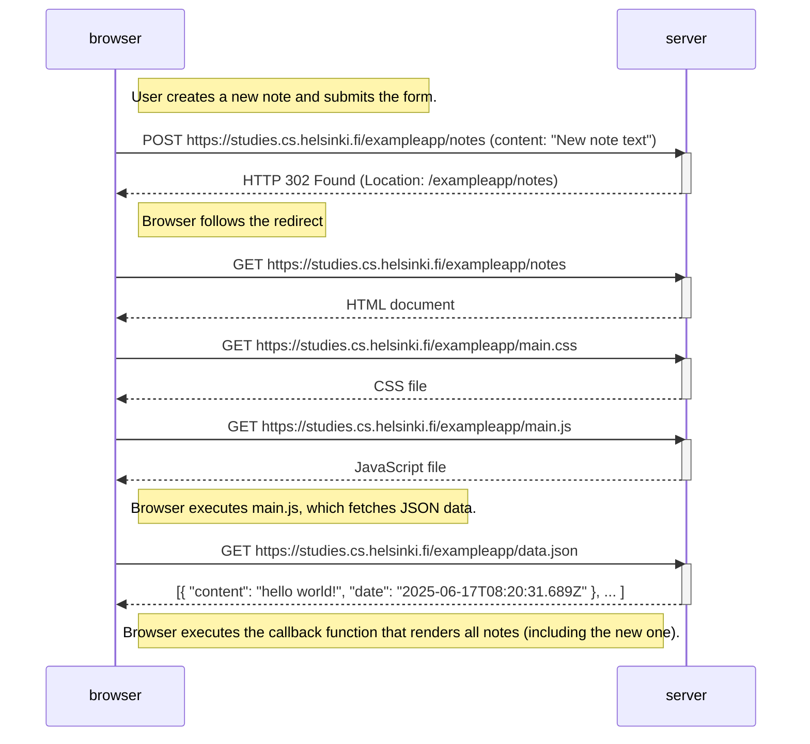

```mermaid

sequenceDiagram

participant browser
participant server

    Note right of browser: User creates a new note and submits the form.

    browser->>server: POST https://studies.cs.helsinki.fi/exampleapp/notes (content: "New note text")
    activate server
    server-->>browser: HTTP 302 Found (Location: /exampleapp/notes)
    deactivate server

    Note right of browser: Browser follows the redirect

    browser->>server: GET https://studies.cs.helsinki.fi/exampleapp/notes
    activate server
    server-->>browser: HTML document
    deactivate server

    browser->>server: GET https://studies.cs.helsinki.fi/exampleapp/main.css
    activate server
    server-->>browser: CSS file
    deactivate server

    browser->>server: GET https://studies.cs.helsinki.fi/exampleapp/main.js
    activate server
    server-->>browser: JavaScript file
    deactivate server

    Note right of browser: Browser executes main.js, which fetches JSON data.

    browser->>server: GET https://studies.cs.helsinki.fi/exampleapp/data.json
    activate server
    server-->>browser: [{ "content": "hello world!", "date": "2025-06-17T08:20:31.689Z" }, ... ]
    deactivate server

    Note right of browser: Browser executes the callback function that renders all notes (including the new one).
```
