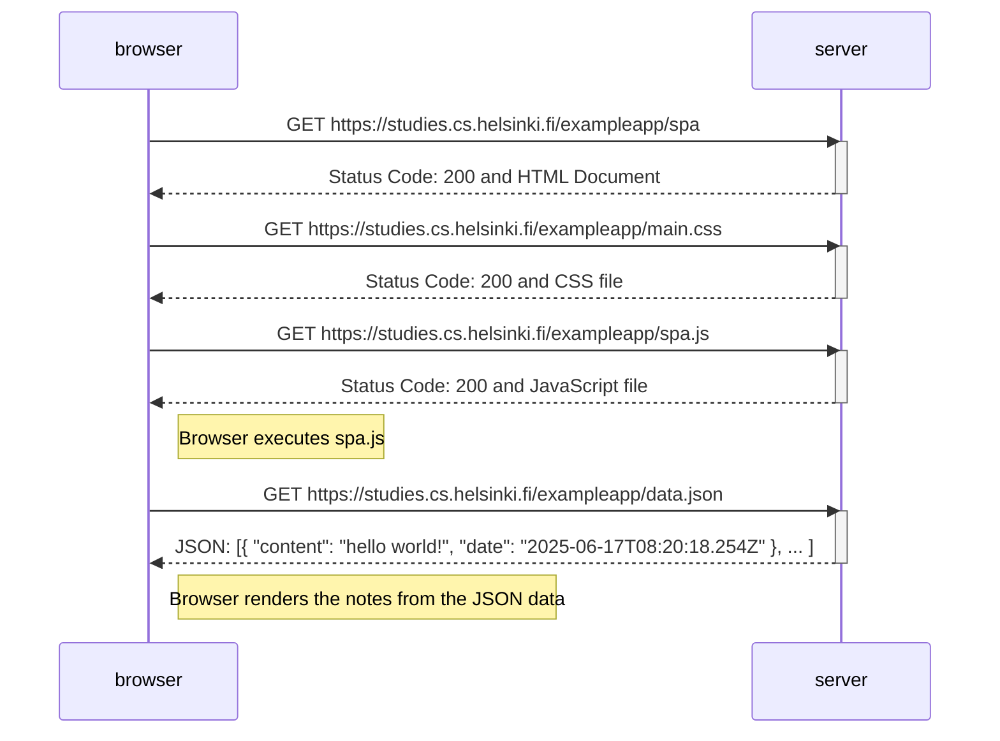

```mermaid


sequenceDiagram
participant browser
participant server

browser->>server: GET https://studies.cs.helsinki.fi/exampleapp/spa
activate server
server-->>browser: Status Code: 200 and HTML Document
deactivate server

browser->>server: GET https://studies.cs.helsinki.fi/exampleapp/main.css
activate server
server-->>browser: Status Code: 200 and CSS file
deactivate server

browser->>server: GET https://studies.cs.helsinki.fi/exampleapp/spa.js
activate server
server-->>browser: Status Code: 200 and JavaScript file
deactivate server

Note right of browser: Browser executes spa.js

browser->>server: GET https://studies.cs.helsinki.fi/exampleapp/data.json
activate server
server-->>browser: JSON: [{ "content": "hello world!", "date": "2025-06-17T08:20:18.254Z" }, ... ]
deactivate server

Note right of browser: Browser renders the notes from the JSON data
```
