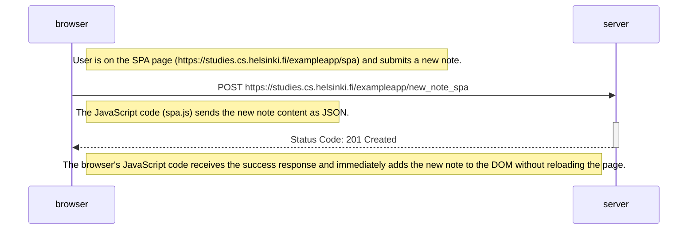

```mermaid

sequenceDiagram
  participant browser
  participant server

  Note right of browser: User is on the SPA page (https://studies.cs.helsinki.fi/exampleapp/spa) and submits a new note.

  browser->>server: POST https://studies.cs.helsinki.fi/exampleapp/new_note_spa
  Note right of browser: The JavaScript code (spa.js) sends the new note content as JSON.
  activate server
  server-->>browser: Status Code: 201 Created
  deactivate server

  Note right of browser: The browser's JavaScript code receives the success response and immediately adds the new note to the DOM without reloading the page.
```
